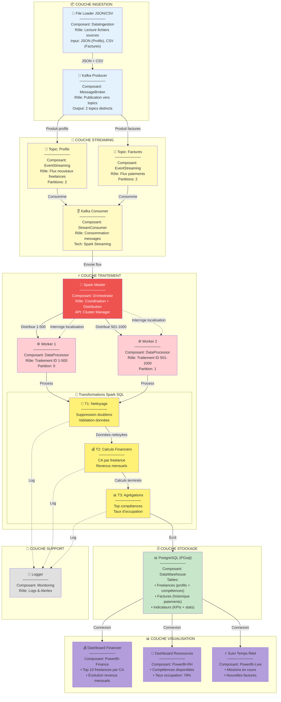

#  Architecture Big Data pour Gestion de Freelances


---

## RÉCAPITULATIF DES 5 LIVRABLES

### ✅ 1. Diagramme de Composants

**Architecture logique en 5 couches** :

1. **Couche Ingestion**
    - File Loader JSON/CSV
    - Kafka Producer

2. **Couche Streaming**
    - **Topic: Profils** (2 partitions)
    - **Topic: Factures** (2 partitions)
    - Kafka Consumer

3. **Couche Traitement**
    - Spark Master (orchestration)
    - Worker 1 (ID 1-500)
    - Worker 2 (ID 501-1000)
    - **T1: Nettoyage** (doublons + validation)
    - **T2: Calculs Financiers** (CA + revenus)
    - **T3: Agrégations** (compétences + taux)

4. **Couche Stockage**
    - PostgreSQL (PGsql)
    - 3 tables : Freelances, Factures, Indicateurs

5. **Couche Visualisation**
    - Dashboard Financier
    - Dashboard Ressources
    - Suivi Temps Réel




---

### ✅ 2. Diagramme de Déploiement
**Fichier** : `diagramme-deploiement-v2.mermaid`

**Infrastructure Cloud en 3 zones** :

**Zone 1 : Ingestion & Streaming**
- Serveur Ingestion : 8 GB RAM, 4 cores
- Kafka Broker 01 : 16 GB RAM, 8 cores
    - Topic Profils (2 partitions)
    - Topic Factures (2 partitions)
- Kafka Broker 02 : Réplication

**Zone 2 : Traitement Distribué**
- Spark Master : 32 GB RAM, 16 cores
- Spark Worker 01 : 16 GB RAM (ID 1-500)
- Spark Worker 02 : 16 GB RAM (ID 501-1000)

**Zone Stockage**
- PostgreSQL : 64 GB RAM, 2 TB SSD
- Object Storage : S3/Blob 10 TB

**Protocoles** :
- SFTP (Port 22) : Upload fichiers
- Kafka (Port 9092) : Streaming
- JDBC (Port 5432) : BDD
- HTTPS : Power BI

---

### ✅ 3. Indicateurs BI et Machine Learning
**Fichier** : `indicateurs-bi-ml-v2.md`

#### 📊 3 Dashboards Power BI

**1. Dashboard Financier**
- Top 10 freelances par CA
- Évolution revenus mensuels (line chart)
- KPIs : CA total, TJM moyen
- Requêtes SQL : CA par freelance, Revenus mensuels

**2. Dashboard Ressources**
- Compétences disponibles (pie chart)
- Taux d'occupation : 78% (gauge)
- Freelances disponibles vs en mission
- Top compétences demandées

**3. Suivi Temps Réel**
- Missions en cours (compteur live)
- Nouvelles factures du jour
- Refresh : 30 secondes
- Alertes factures en retard

#### 🤖 3 Modèles ML

**1. Prédiction CA Mensuel**
- Type : Time Series (ARIMA/Prophet)
- MAPE cible : < 15%
- Prédiction : 3 mois

**2. Matching Freelance-Compétence**
- Type : Content-Based Filtering
- Precision@5 : > 70%

**3. Détection Anomalies Factures**
- Type : Isolation Forest
- Taux faux positifs : < 5%

#### 💾 3 Transformations Spark SQL

**T1: Nettoyage**
```sql
-- Suppression doublons
-- Validation formats (email, dates, montants)
-- Normalisation données
```

**T2: Calculs Financiers**
```sql
-- CA par freelance
-- Revenus mensuels
-- TJM moyen par compétence
```

**T3: Agrégations**
```sql
-- Top compétences demandées
-- Taux d'occupation global
-- KPIs consolidés
```

---

### ✅ 4. Backlog Teams
**Fichier** : `backlog-teams-v2.md`

**7 Epics, 14 User Stories**

**EPIC 1 : Infrastructure Kafka**
- US-1.1 : Configuration 2 Topics (8 pts)
- US-1.2 : Script ingestion JSON/CSV (5 pts)

**EPIC 2 : Cluster Spark**
- US-2.1 : Déploiement Spark (8 pts)
- US-2.2 : Consumer Kafka → Spark (13 pts)

**EPIC 3 : Transformations SQL**
- US-3.1 : T1 Nettoyage (5 pts)
- US-3.2 : T2 Calculs Financiers (8 pts)
- US-3.3 : T3 Agrégations (8 pts)

**EPIC 4 : Data Warehouse**
- US-4.1 : Schéma PostgreSQL (5 pts)
- US-4.2 : Pipeline ETL (8 pts)

**EPIC 5 : Dashboards Power BI**
- US-5.1 : Dashboard Financier (5 pts)
- US-5.2 : Dashboard Ressources (5 pts)
- US-5.3 : Suivi Temps Réel (8 pts)

**EPIC 6 : Machine Learning**
- US-6.1 : Prédiction CA (13 pts)
- US-6.2 : Détection anomalies (13 pts)

**Planning : 7 Sprints - 14 semaines**

| Sprint | Stories | Points | Objectif |
|--------|---------|--------|----------|
| Sprint 1 | 1.1, 1.2, 2.1 | 21 | Infra Kafka + Spark |
| Sprint 2 | 2.2, 3.1, 3.2, 4.1 | 31 | Transformations + DB |
| Sprint 3 | 3.3, 4.2, 5.1 | 21 | T3 + Dashboard Financier |
| Sprint 4 | 5.2 | 5 | Dashboard Ressources |
| Sprint 5 | 5.3 | 8 | Suivi Temps Réel |
| Sprint 6 | 6.1 | 13 | ML Prédiction |
| Sprint 7 | 6.2 | 13 | ML Anomalies |

**Total : 125 points**

---

### ✅ 5. Fichier Excel Git-Backlog
**Fichier** : `suivi_git_backlog_v2.xlsx`

**3 Feuilles Excel** :

#### Feuille 1 : Suivi Git-Backlog
- **14 User Stories** avec :
    - Epic, ID, Titre, Priorité, Points
    - Sprint, Assignation, Statut
    - Liens Git (branches, commits)
    - Liens Backlog (Azure DevOps)
    - Dates (début, fin)
    - Notes détaillées

**Mise en forme** :
- 🟢 Terminé (fond vert)
- 🟡 En cours (fond jaune)
- 🔴 À faire (fond rouge)
- Priorités colorées (Haute=rouge, Moyenne=orange, Basse=vert)

#### Feuille 2 : Statistiques
**KPIs automatiques** (formules Excel) :
- Total User Stories
- US par statut (Terminé, En cours, À faire)
- Points totaux et complétés
- Taux de complétion (%)
- Répartition par priorité

#### Feuille 3 : Architecture
**Résumé technique** :
- Sources : JSON + CSV
- Kafka : 2 topics (Profils, Factures)
- Spark : 1 Master + 2 Workers
- Transformations : T1, T2, T3
- Stockage : PostgreSQL (3 tables)
- BI : 3 dashboards Power BI
- ML : 2 modèles (Prédiction + Détection)

---

## 🔍 ARCHITECTURE DÉTAILLÉE

### 📥 Sources de Données
- **Fichiers JSON** : Profils freelances
  ```json
  {nom: "Dupont", compétences: ["Python"], tarif_jour: 450€}
  ```
- **Fichiers CSV** : Factures
  ```
  freelance, montant, date
  Dupont, 4500€, Oct-2025
  ```

### 🚀 Kafka - 2 Topics
1. **Topic: Profils**
    - Reçoit les nouveaux freelances
    - 2 partitions
    - Réplication factor = 2

2. **Topic: Factures**
    - Reçoit les paiements
    - 2 partitions
    - Réplication factor = 2

### ⚡ Spark - Architecture Distribuée

**Nœud Maître** :
- Coordonne le travail
- Distribue les tâches
- Interroge les workers : *"Tu as les données du freelance #245 ?"*

**Worker 1** :
- Traite freelances ID 1-500
- Partition 0

**Worker 2** :
- Traite freelances ID 501-1000
- Partition 1

### 💾 3 Transformations Spark SQL

**T1 : Nettoyage**
- Supprime doublons
- Valide les données

**T2 : Calculs Financiers**
- CA par freelance
- Revenus mensuels

**T3 : Agrégations**
- Top compétences demandées
- Taux d'occupation

### 🗄️ PostgreSQL (PGsql)

**Base : freelances_db**

**3 Tables** :
1. **Freelances** : Profils et compétences
2. **Factures** : Historique paiements
3. **Indicateurs** : KPIs et statistiques

### 📊 Power BI - 3 Dashboards

**1. Dashboard Financier**
- Top 10 freelances par CA
- Évolution revenus mensuels

**2. Dashboard Ressources**
- Compétences disponibles
- Taux d'occupation : 78%

**3. Suivi Temps Réel**
- Missions en cours
- Nouvelles factures

---

## 🎯 CONCEPTS BIG DATA DÉMONTRÉS

### 1️⃣ Distribution des Données
- **Kafka** : 2 topics avec 2 partitions chacun
- **Spark** : 2 workers traitent en parallèle
- **Résultat** : Traitement 2x plus rapide

### 2️⃣ Localité des Données
**Scénario** :
- Maître : *"Worker 1, tu as les données de Dupont (#245) ?"*
- Worker 1 : *"Oui, en mémoire, je te les renvoie"*
- **Avantage** : Évite les transferts réseau

### 3️⃣ Scalabilité Horizontale
- Besoin de plus de puissance ?
- Ajoutez des workers : 2 → 4 → 8
- Performance augmente linéairement

### 4️⃣ Temps Réel avec Streaming
- Kafka ingère les données instantanément
- Spark Streaming traite en continu
- Power BI affiche en temps réel (30s refresh)

---

## 🛠️ STACK TECHNIQUE

| Composant | Technologie | Version | Rôle |
|-----------|------------|---------|------|
| Sources | JSON + CSV | - | Données brutes |
| Streaming | Apache Kafka | 3.x | 2 topics (Profils, Factures) |
| Traitement | Apache Spark | 3.5 | 1 Master + 2 Workers |
| SQL | Spark SQL | 3.5 | 3 Transformations (T1, T2, T3) |
| Stockage | PostgreSQL | 15 | Data Warehouse (PGsql) |
| BI | Power BI | Desktop | 3 Dashboards |
| ML | Spark MLlib | 3.5 | 2 Modèles prédictifs |
| CI/CD | GitHub Actions | - | Déploiement |
| Cloud | AWS/Azure | - | Infrastructure |

---

## 📊 KPIS PROJET

| KPI | Cible | Mesure |
|-----|-------|--------|
| **CA Mensuel** | 150k€ | Dashboard Financier |
| **Taux Occupation** | 78% | Dashboard Ressources |
| **Top 10 CA** | 60% du total | Dashboard Financier |
| **Nouvelles Factures/jour** | 20+ | Suivi Temps Réel |
| **Prédiction CA MAPE** | < 15% | Modèle ML |
| **Détection Anomalies** | > 85% | Modèle ML |

---

## 🎓 POINTS CLÉS POUR LA SOUTENANCE

### Architecture Technique ✅
- **2 Topics Kafka** séparent Profils et Factures
- **2 Workers Spark** traitent ID 1-500 et 501-1000
- **3 Transformations** : Nettoyage → Calculs → Agrégations
- **3 Dashboards** : Financier, Ressources, Temps Réel

### Big Data ✅
- **Volume** : 1000 freelances, milliers de factures
- **Vélocité** : Kafka streaming temps réel
- **Variété** : JSON + CSV
- **Valeur** : KPIs métier + ML prédictif

### Gestion Projet ✅
- **Agile** : 7 sprints, 14 semaines
- **125 points** de complexité
- **14 User Stories** réparties en 7 Epics
- **Excel de suivi** avec liens Git/Backlog

### Démonstration ✅
1. Montrer le **pipeline Mermaid** (flux complet)
2. Expliquer la **distribution** (Worker 1 vs Worker 2)
3. Présenter les **3 dashboards Power BI**
4. Démontrer la **localité** (interrogation workers)

---

## 📁 FICHIERS LIVRÉS

```
/mnt/user-data/outputs/
├── pipeline-simple-clair.mermaid          # Pipeline complet
├── diagramme-composants-v2.mermaid       # Architecture logique
├── diagramme-deploiement-v2.mermaid      # Infrastructure physique
├── indicateurs-bi-ml-v2.md               # KPIs + ML détaillés
├── backlog-teams-v2.md                   # 14 User Stories
├── suivi_git_backlog_v2.xlsx             # Excel de suivi
└── recapitulatif-final.md                # Ce document
```

---

## 🚀 PROCHAINES ÉTAPES

1. ✅ **Validation** : Revue avec le tuteur
2. ⏳ **Présentation** : Slides PowerPoint
3. ⏳ **Démo** : Prototype avec données test
4. ⏳ **Rapport** : Document technique complet
5. ⏳ **Soutenance** : Présentation + Q&A

---

## 💡 STRUCTURE PRÉSENTATION (15-20 min)

**1. Contexte (2 min)**
- Plateforme de 1000 freelances
- Problème : Volume de données + besoin temps réel

**2. Architecture (8 min)**
- Présenter le pipeline complet
- Expliquer les 2 topics Kafka
- Détailler la distribution sur 2 workers
- Montrer les 3 transformations SQL

**3. Dashboards & KPIs (5 min)**
- Dashboard Financier : Top 10 + Évolution
- Dashboard Ressources : Compétences + 78%
- Suivi Temps Réel : Missions + Factures

**4. Big Data (3 min)**
- Distribution : 2x plus rapide
- Localité : Éviter transferts réseau
- Scalabilité : 2 → 4 → 8 workers
- Temps réel : Kafka + Spark Streaming

**5. Gestion Projet (2 min)**
- 7 sprints, 14 semaines
- 125 points de complexité
- Excel de suivi Git-Backlog

---

## ❓ QUESTIONS PROBABLES DU JURY

**Techniques** :
- *"Pourquoi 2 topics au lieu d'un seul ?"*
  → Séparation des concerns, scalabilité indépendante

- *"Comment gérer la panne d'un worker ?"*
  → Spark réassigne automatiquement les tâches

- *"Pourquoi PostgreSQL et pas MongoDB ?"*
  → Besoin de transactions ACID et requêtes SQL complexes

**Métier** :
- *"Quel ROI pour l'entreprise ?"*
  → Automatisation, insights temps réel, prédictions CA

- *"Combien de temps pour déployer ?"*
  → 14 semaines (7 sprints de 2 semaines)

**Projet** :
- *"Quelles difficultés rencontrées ?"*
  → Synchronisation Kafka-Spark, optimisation requêtes SQL

- *"Si c'était à refaire ?"*
  → Commencer plus tôt les tests d'intégration

---

## ✅ CHECKLIST FINALE

- ✅ Pipeline FreelanceFlow validé
- ✅ Diagramme composants (2 topics, 3 transformations)
- ✅ Diagramme déploiement (infrastructure cloud)
- ✅ Indicateurs BI (3 dashboards détaillés)
- ✅ Backlog Teams (14 US, 7 sprints)
- ✅ Excel Git-Backlog (3 feuilles complètes)
- ✅ Récapitulatif final (ce document)

---

**🎓 Tous les livrables sont prêts pour votre soutenance !**

**Bonne chance ! 🚀**

---

**Dernière mise à jour** : 20/11/2025 - Version Finale  
**Projet** : FreelanceFlow - Architecture Big Data  
**Étudiant** : [Votre Nom]  
**École** : [École d'Ingénieur]
