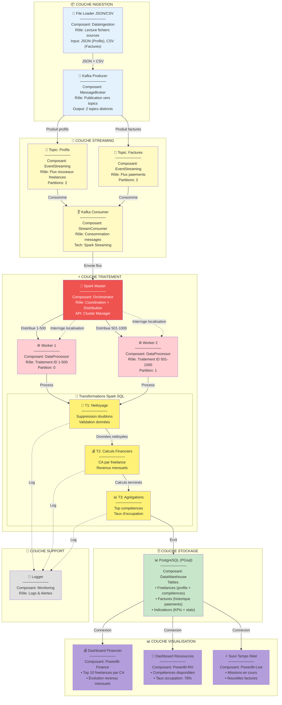
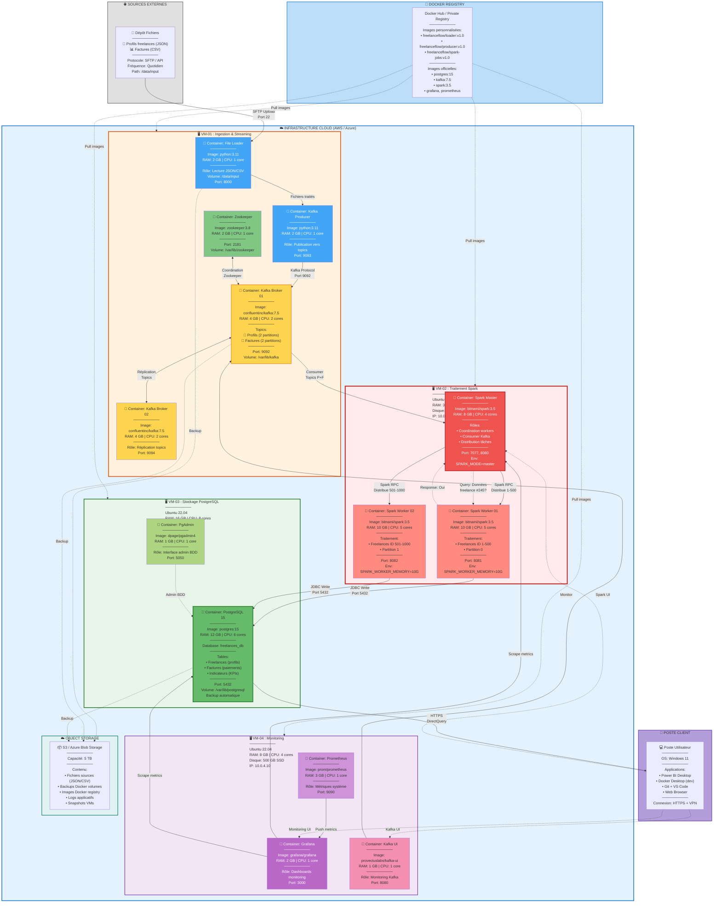

#  Architecture Big Data pour Gestion de Freelances


---

## RÉCAPITULATIF DES 5 LIVRABLES

### ✅ 1. Diagramme de Composants

**Architecture logique en 5 couches** :

1. **Couche Ingestion**
    - File Loader JSON/CSV
    - Kafka Producer

2. **Couche Streaming**
    - **Topic: Profils** (2 partitions)
    - **Topic: Factures** (2 partitions)
    - Kafka Consumer

3. **Couche Traitement**
    - Spark Master (orchestration)
    - Worker 1 (ID 1-500)
    - Worker 2 (ID 501-1000)
    - **T1: Nettoyage** (doublons + validation)
    - **T2: Calculs Financiers** (CA + revenus)
    - **T3: Agrégations** (compétences + taux)

4. **Couche Stockage**
    - PostgreSQL (PGsql)
    - 3 tables : Freelances, Factures, Indicateurs

5. **Couche Visualisation**
    - Dashboard Financier
    - Dashboard Ressources
    - Suivi Temps Réel




---

### ✅ 2. Diagramme de Déploiement



---

### ✅ 3. Indicateurs BI et Machine Learning

#### 📊 3 Dashboards Power BI

**1. Dashboard Financier**
- Top 10 freelances par CA
- Évolution revenus mensuels (line chart)
- KPIs : CA total, TJM moyen
- Requêtes SQL : CA par freelance, Revenus mensuels

**2. Dashboard Ressources**
- Compétences disponibles (pie chart)
- Taux d'occupation : 78% (gauge)
- Freelances disponibles vs en mission
- Top compétences demandées

**3. Suivi Temps Réel**
- Missions en cours (compteur live)
- Nouvelles factures du jour
- Refresh : 30 secondes
- Alertes factures en retard

#### 🤖 3 Modèles ML

**1. Prédiction CA Mensuel**
- Type : Time Series (ARIMA/Prophet)
- MAPE cible : < 15%
- Prédiction : 3 mois

**2. Matching Freelance-Compétence**
- Type : Content-Based Filtering
- Precision@5 : > 70%

**3. Détection Anomalies Factures**
- Type : Isolation Forest
- Taux faux positifs : < 5%

#### 💾 3 Transformations Spark SQL

**T1: Nettoyage**
```sql
-- Suppression doublons
-- Validation formats (email, dates, montants)
-- Normalisation données
```

**T2: Calculs Financiers**
```sql
-- CA par freelance
-- Revenus mensuels
-- TJM moyen par compétence
```

**T3: Agrégations**
```sql
-- Top compétences demandées
-- Taux d'occupation global
-- KPIs consolidés
```

---

### ✅ 4. Backlog Teams


#### 📋 FreelanceFlow - Backlog Projet (Version Finale)

## 🎯 EPIC 1 : Infrastructure Kafka & Ingestion

### 📦 User Story 1.1 : Configuration Kafka avec 2 Topics
**En tant que** Data Engineer  
**Je veux** configurer un cluster Kafka avec 2 topics distincts  
**Afin de** séparer les flux Profils et Factures

**Critères d'acceptation** :
- [ ] Cluster Kafka déployé avec 2 brokers
- [ ] **Topic "Profils"** créé avec 2 partitions
- [ ] **Topic "Factures"** créé avec 2 partitions
- [ ] Réplication factor = 2 pour chaque topic
- [ ] Tests production/consommation sur les 2 topics
- [ ] Monitoring topics dans Kafka UI

**Priorité** : 🔴 Haute  
**Points de complexité** : 8  
**Sprint** : Sprint 1  
**Assigné à** : @DataEngineering  
**Tags** : `infrastructure` `kafka` `topics` `streaming`

---

### 📦 User Story 1.2 : Script ingestion JSON/CSV vers Kafka
**En tant que** Data Engineer  
**Je veux** créer un producer Kafka qui lit JSON et CSV  
**Afin de** publier vers les bons topics

**Critères d'acceptation** :
- [ ] Lecture fichiers JSON (profils freelances)
- [ ] Lecture fichiers CSV (factures)
- [ ] Publication JSON → Topic "Profils"
- [ ] Publication CSV → Topic "Factures"
- [ ] Chargement quotidien automatisé
- [ ] Logs des publications
- [ ] Gestion erreurs et retry

**Priorité** : 🔴 Haute  
**Points de complexité** : 5  
**Sprint** : Sprint 1  
**Assigné à** : @Developer1  
**Tags** : `python` `kafka-producer` `json` `csv`

---

## ⚡ EPIC 2 : Cluster Spark & Distribution

### 📦 User Story 2.1 : Déploiement Cluster Spark
**En tant que** Data Engineer  
**Je veux** déployer 1 master + 2 workers  
**Afin de** traiter les données en parallèle

**Critères d'acceptation** :
- [ ] Spark Master configuré (32 GB RAM, 16 cores)
- [ ] Worker 1 : traitement ID 1-500 (16 GB RAM)
- [ ] Worker 2 : traitement ID 501-1000 (16 GB RAM)
- [ ] Interface Web Spark accessible
- [ ] Tests de distribution fonctionnels
- [ ] Configuration mémoire optimisée

**Priorité** : 🔴 Haute  
**Points de complexité** : 8  
**Sprint** : Sprint 1  
**Assigné à** : @DevOps  
**Tags** : `spark` `infrastructure` `distributed`

---

### 📦 User Story 2.2 : Consumer Kafka vers Spark
**En tant que** Data Engineer  
**Je veux** consommer les 2 topics Kafka avec Spark Streaming  
**Afin de** alimenter le traitement distribué

**Critères d'acceptation** :
- [ ] Consumer Spark Streaming fonctionnel
- [ ] Lecture Topic "Profils"
- [ ] Lecture Topic "Factures"
- [ ] Transformation en DataFrame Spark
- [ ] Distribution vers workers appropriés
- [ ] Gestion offsets Kafka
- [ ] Tests d'intégration

**Priorité** : 🔴 Haute  
**Points de complexité** : 13  
**Sprint** : Sprint 2  
**Assigné à** : @Developer2  
**Tags** : `spark-streaming` `kafka-consumer` `dataframe`

---

## 💾 EPIC 3 : Transformations Spark SQL

### 📦 User Story 3.1 : T1 - Nettoyage des données
**En tant que** Data Analyst  
**Je veux** implémenter le module de nettoyage  
**Afin de** supprimer doublons et valider les données

**Critères d'acceptation** :
- [ ] Suppression doublons (profils + factures)
- [ ] Validation emails (format correct)
- [ ] Validation montants (> 0)
- [ ] Validation dates (format ISO)
- [ ] Gestion valeurs nulles
- [ ] Logs des rejets
- [ ] Métriques qualité données

**Priorité** : 🔴 Haute  
**Points de complexité** : 5  
**Sprint** : Sprint 2  
**Assigné à** : @DataAnalyst  
**Tags** : `spark-sql` `data-quality` `cleaning`

---

### 📦 User Story 3.2 : T2 - Calculs Financiers
**En tant que** Data Analyst  
**Je veux** calculer les métriques financières  
**Afin de** obtenir CA par freelance et revenus mensuels

**Critères d'acceptation** :
- [ ] Calcul CA par freelance
- [ ] Calcul revenus mensuels
- [ ] TJM moyen par compétence
- [ ] Agrégation par période
- [ ] Requêtes SQL optimisées (< 5s)
- [ ] Tests unitaires calculs

**Priorité** : 🔴 Haute  
**Points de complexité** : 8  
**Sprint** : Sprint 2  
**Assigné à** : @DataAnalyst  
**Tags** : `spark-sql` `financial` `kpi`

---

### 📦 User Story 3.3 : T3 - Agrégations
**En tant que** Data Analyst  
**Je veux** calculer les agrégations métier  
**Afin d'** obtenir top compétences et taux d'occupation

**Critères d'acceptation** :
- [ ] Top compétences demandées
- [ ] Taux d'occupation : 78% (target)
- [ ] Statistiques par catégorie
- [ ] Freelances disponibles par compétence
- [ ] Requêtes avec window functions
- [ ] Performance < 3s

**Priorité** : 🟡 Moyenne  
**Points de complexité** : 8  
**Sprint** : Sprint 3  
**Assigné à** : @DataAnalyst  
**Tags** : `spark-sql` `aggregation` `analytics`

---

## 🗄️ EPIC 4 : Data Warehouse PostgreSQL

### 📦 User Story 4.1 : Création schéma PostgreSQL (PGsql)
**En tant que** Data Architect  
**Je veux** créer le schéma de base PostgreSQL  
**Afin de** stocker les 3 tables principales

**Critères d'acceptation** :
- [ ] Base `freelances_db` créée
- [ ] Table `Freelances` (profils + compétences)
- [ ] Table `Factures` (historique paiements)
- [ ] Table `Indicateurs` (KPIs + statistiques)
- [ ] Index optimisés
- [ ] Contraintes d'intégrité
- [ ] Documentation schéma

**Priorité** : 🔴 Haute  
**Points de complexité** : 5  
**Sprint** : Sprint 2  
**Assigné à** : @DataArchitect  
**Tags** : `postgresql` `pgsql` `schema` `database`

---

### 📦 User Story 4.2 : Pipeline ETL Spark → PostgreSQL
**En tant que** Data Engineer  
**Je veux** écrire les données transformées dans PostgreSQL  
**Afin de** persister les résultats des transformations T1, T2, T3

**Critères d'acceptation** :
- [ ] Connexion JDBC Spark → PostgreSQL
- [ ] Écriture table Freelances
- [ ] Écriture table Factures
- [ ] Écriture table Indicateurs
- [ ] Mode upsert (insert/update)
- [ ] Transactions ACID
- [ ] Tests de charge

**Priorité** : 🔴 Haute  
**Points de complexité** : 8  
**Sprint** : Sprint 3  
**Assigné à** : @Developer1  
**Tags** : `etl` `jdbc` `postgresql` `pgsql`

---

## 📊 EPIC 5 : Dashboards Power BI

### 📦 User Story 5.1 : Dashboard Financier
**En tant que** Directeur Financier  
**Je veux** visualiser le Top 10 et l'évolution des revenus  
**Afin de** suivre la performance financière

**Critères d'acceptation** :
- [ ] **Top 10 freelances par CA** : graphique bar chart
- [ ] **Évolution revenus mensuels** : line chart 12 mois
- [ ] Filtres : période, compétence
- [ ] KPI : CA total, TJM moyen
- [ ] Refresh quotidien automatique
- [ ] Export Excel

**Priorité** : 🔴 Haute  
**Points de complexité** : 5  
**Sprint** : Sprint 3  
**Assigné à** : @BIAnalyst  
**Tags** : `powerbi` `dashboard` `finance`

---

### 📦 User Story 5.2 : Dashboard Ressources
**En tant que** Responsable RH  
**Je veux** voir les compétences disponibles et le taux d'occupation  
**Afin d'** optimiser l'allocation des freelances

**Critères d'acceptation** :
- [ ] **Compétences disponibles** : pie chart par techno
- [ ] **Taux d'occupation : 78%** : gauge visual
- [ ] Répartition freelances disponibles/en mission
- [ ] Filtres par compétence
- [ ] Alerte si taux < 60% ou > 90%
- [ ] Détail freelances disponibles (table)

**Priorité** : 🔴 Haute  
**Points de complexité** : 5  
**Sprint** : Sprint 4  
**Assigné à** : @BIAnalyst  
**Tags** : `powerbi` `dashboard` `hr` `resources`

---

### 📦 User Story 5.3 : Suivi Temps Réel
**En tant que** Manager Opérationnel  
**Je veux** voir les missions en cours et nouvelles factures  
**Afin de** piloter l'activité en temps réel

**Critères d'acceptation** :
- [ ] **Missions en cours** : compteur + liste
- [ ] **Nouvelles factures** : compteur du jour
- [ ] Refresh toutes les 30 secondes
- [ ] Dernières 10 factures créées (table)
- [ ] Alertes : factures en retard
- [ ] Indicateur statut système (vert/orange/rouge)

**Priorité** : 🟡 Moyenne  
**Points de complexité** : 8  
**Sprint** : Sprint 5  
**Assigné à** : @BIAnalyst  
**Tags** : `powerbi` `realtime` `streaming` `monitoring`

---

## 🤖 EPIC 6 : Machine Learning

### 📦 User Story 6.1 : Modèle prédiction CA
**En tant que** Data Scientist  
**Je veux** créer un modèle Time Series pour prédire le CA  
**Afin d'** anticiper les revenus des 3 prochains mois

**Critères d'acceptation** :
- [ ] Collecte historique CA mensuel (12+ mois)
- [ ] Feature engineering (saisonnalité, tendances)
- [ ] Entraînement modèle (ARIMA/Prophet)
- [ ] MAPE < 15%
- [ ] Prédictions à 3 mois
- [ ] Intégration dans Dashboard Financier
- [ ] Documentation modèle

**Priorité** : 🟡 Moyenne  
**Points de complexité** : 13  
**Sprint** : Sprint 6  
**Assigné à** : @DataScientist  
**Tags** : `ml` `timeseries` `forecasting` `arima`

---

### 📦 User Story 6.2 : Détection anomalies factures
**En tant que** Contrôleur Financier  
**Je veux** détecter automatiquement les factures suspectes  
**Afin de** prévenir les fraudes

**Critères d'acceptation** :
- [ ] Algorithme Isolation Forest
- [ ] Features : montant, fréquence, TJM
- [ ] Taux faux positifs < 5%
- [ ] Intégration Suivi Temps Réel
- [ ] Alertes automatiques
- [ ] Dashboard anomalies détectées

**Priorité** : 🟢 Basse  
**Points de complexité** : 13  
**Sprint** : Sprint 7  
**Assigné à** : @DataScientist  
**Tags** : `ml` `anomaly-detection` `fraud`

---

## 🔧 EPIC 7 : DevOps & Monitoring

### 📦 User Story 7.1 : CI/CD Pipeline
**En tant que** DevOps Engineer  
**Je veux** automatiser le déploiement  
**Afin d'** accélérer les mises en production

**Critères d'acceptation** :
- [ ] Pipeline GitHub Actions / GitLab CI
- [ ] Tests automatisés (unit + integration)
- [ ] Build Docker images (Kafka, Spark)
- [ ] Déploiement auto sur dev
- [ ] Validation manuelle pour prod
- [ ] Rollback automatique si erreur

**Priorité** : 🟡 Moyenne  
**Points de complexité** : 8  
**Sprint** : Sprint 3  
**Assigné à** : @DevOps  
**Tags** : `cicd` `automation` `deployment` `docker`

---

### 📦 User Story 7.2 : Monitoring système
**En tant que** Ops Engineer  
**Je veux** monitorer la santé de l'infrastructure  
**Afin de** détecter les problèmes rapidement

**Critères d'acceptation** :
- [ ] Monitoring Kafka (lag, throughput)
- [ ] Monitoring Spark (jobs, stages)
- [ ] Monitoring PostgreSQL (connexions, queries)
- [ ] Métriques système (CPU, RAM, Disk)
- [ ] Alertes emails/Slack
- [ ] Dashboard Grafana
- [ ] SLA : uptime > 99%

**Priorité** : 🟡 Moyenne  
**Points de complexité** : 8  
**Sprint** : Sprint 4  
**Assigné à** : @DevOps  
**Tags** : `monitoring` `grafana` `alerting` `sla`

---

## 🔍 ARCHITECTURE DÉTAILLÉE

### 📥 Sources de Données
- **Fichiers JSON** : Profils freelances
  ```json
  {"nom": "Dupont", "compétences": ["Python"], "tarif_jour": "450€"}
  ```
- **Fichiers CSV** : Factures
  ```
  freelance, montant, date
  Dupont, 4500€, Oct-2025
  ```

### 🚀 Kafka - 2 Topics
1. **Topic: Profils**
    - Reçoit les nouveaux freelances
    - 2 partitions
    - Réplication factor = 2

2. **Topic: Factures**
    - Reçoit les paiements
    - 2 partitions
    - Réplication factor = 2

### ⚡ Spark - Architecture Distribuée

**Nœud Maître** :
- Coordonne le travail
- Distribue les tâches
- Interroge les workers : *"Tu as les données du freelance #245 ?"*

**Worker 1** :
- Traite freelances ID 1-500
- Partition 0

**Worker 2** :
- Traite freelances ID 501-1000
- Partition 1

### 💾 3 Transformations Spark SQL

**T1 : Nettoyage**
- Supprime doublons
- Valide les données

**T2 : Calculs Financiers**
- CA par freelance
- Revenus mensuels

**T3 : Agrégations**
- Top compétences demandées
- Taux d'occupation

### 🗄️ PostgreSQL (PGsql)

**Base : freelances_db**

**3 Tables** :
1. **Freelances** : Profils et compétences
2. **Factures** : Historique paiements
3. **Indicateurs** : KPIs et statistiques

### 📊 Power BI - 3 Dashboards

**1. Dashboard Financier**
- Top 10 freelances par CA
- Évolution revenus mensuels

**2. Dashboard Ressources**
- Compétences disponibles
- Taux d'occupation : 78%

**3. Suivi Temps Réel**
- Missions en cours
- Nouvelles factures

---
